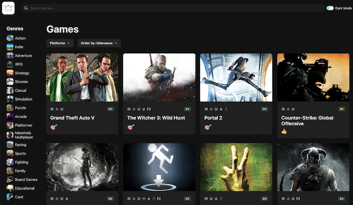

[Link to App](https://game-hub-xi-azure.vercel.app)

# Video Game Discovery Web App - Tools Used:

- Created with Vite, coded in html/css/typescript/react

- RAWG API, React Query & Router, Zustand

- Chakra UI library for certain component features

- Deployed with Vercel

# App Features

- Search bar for finding game titles

- Light/Dark modes

- Genre list to filter by game genres

- Filter to search for games on a particular platform

- Further filter to search by game popularity,
  release date, rating etc

- Game details page for more game details, photos
  and video teaser

- Infinite scrolling, responsive screen sizing
